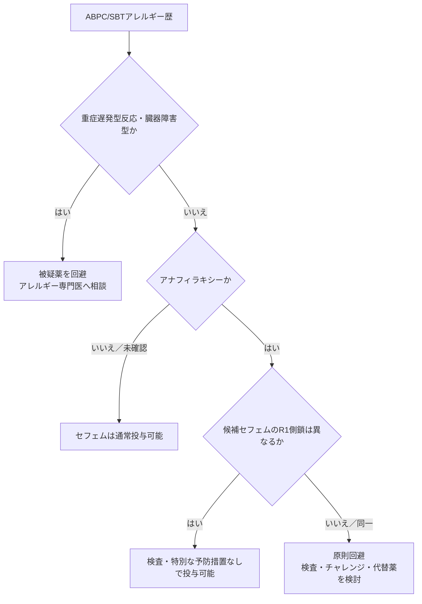

# 抗菌薬アレルギー

抗菌薬アレルギー歴がある患者で、反応型と交差反応性を整理し、必要な抗菌薬を安全に選択するためのクイックリファレンス。現時点では、**ABPC/SBTアレルギー時のセフェム選択**を中心にまとめる。

## 初期評価

抗菌薬の「アレルギー」ラベルだけで一律に同系統薬を避けず、以下を確認する。

| 評価項目 | 確認内容 |
|---|---|
| 被疑薬 | 一般名、配合剤、同時投与薬 |
| 症状 | 蕁麻疹、血管性浮腫、呼吸器症状、血圧低下、皮疹、発熱、臓器障害、消化器症状 |
| 発症時期 | 投与直後〜数時間、数日後、投与終了後 |
| 重症度 | アナフィラキシー、SCAR、臓器障害の有無 |
| 経過 | 発症からの年数、治療内容、再投与歴 |
| 忍容歴 | その後に問題なく使用できたペニシリン系・セフェム系 |

!!! info "アレルギーとは限らない病歴"
    悪心、下痢、頭痛などの薬理学的副作用、原疾患に伴う発疹、家族歴のみの場合は、免疫学的な薬物アレルギーとは区別する。

!!! danger "重症遅発型反応は別扱い"
    SJS/TEN、DRESS、AGEP、間質性腎炎、溶血性貧血などでは、単純に側鎖の違いだけで投与可否を判断しない。原則として被疑薬を避け、アレルギー専門医へ相談する。

---

## ABPC/SBTアレルギー時のセフェム選択

### 要点

- ABPC/SBT（アンピシリン・スルバクタム）アレルギーの既往があっても、**R1側鎖が異なるセフェム系抗菌薬の交差反応性は低く、通常は投与可能**
- 交差反応はβラクタム環そのものよりも、主に**R1側鎖の構造類似性**で決まる
- 特に**セファゾリンは独自の側鎖**を持ち、ペニシリン系との交差反応性は極めて低い
- ただし、まず原因薬、症状、発症時期、重症度を確認する。**SCARなどの重症遅発型反応は別扱い**とする

### 交差反応率

ペニシリン系とセフェム系の交差反応率は従来 **8〜10%** とされていたが、これは1980年以前のセフェム製剤へのペニシリン混入や、評価対象となった薬剤の偏りによる過大評価と考えられている。1980年以降の研究では、全体の推定交差反応率は**約2%**である。

| R1側鎖の類似度 | セフェムの例 | 交差反応率 |
|---|---|---:|
| 同一（アミノセファロスポリン） | セファレキシン、セファドロキシル、セフプロジル、セファクロルなど | **16.45%**（95% CI 11.07〜23.75） |
| 低類似度 | セファゾリン、セフポドキシム、セフトリアキソン、セフタジジム、セフェピムなど | **2.11%**（95% CI 0.98〜4.46） |

!!! note "アミノペニシリンとの側鎖"
    アミノセファロスポリンの中でも、ABPCと同一のR1側鎖を持つ代表薬はセファレキシン、セファクロルである。AMPCではセファドロキシル、セフプロジルなどが該当する。選択的なABPC/AMPCアレルギーが証明されている場合は、対応する同一R1側鎖の薬剤を避ける。

---

### AAAAI 2022年薬物アレルギー診療パラメータ

米国アレルギー・喘息・免疫学会（AAAAI）の2022年診療パラメータでは、以下が推奨されている。

1. **ペニシリンによるアナフィラキシー歴あり**  
   構造的に異なるR1側鎖を持つセフェムは、検査や特別な予防措置なしに投与可能（条件付き推奨、エビデンスの確実性：中等度）。
2. **未確認の非アナフィラキシー型ペニシリンアレルギー**  
   セフェムは検査や特別な予防措置なしに投与可能（条件付き推奨、エビデンスの確実性：中等度）。
3. **選択的アミノペニシリンアレルギーが証明済み**  
   同一R1側鎖を持つアミノセファロスポリンは原則として避ける。未確認かつ非アナフィラキシー型で、同一側鎖薬が必要な場合は薬物チャレンジを検討できる。

---

### CDC性感染症治療ガイドライン

- IgE介在性ペニシリンアレルギー患者における交差反応率は、第3世代セフェム（セフトリアキソン、セフィキシムなど）で**1%未満**
- 第1・2世代セフェムでは**1〜8%**
- 過去10年以内にペニシリンによるIgE介在性症状（アナフィラキシー、蕁麻疹など）がなければ、第3・4世代セフェムおよびカルバペネムの使用は安全とされる

---

### PIPC/TAZアレルギーラベル患者のデータ

PIPC/TAZ（ピペラシリン・タゾバクタム）アレルギーラベルを持つ患者を対象とした2024年の報告では、セフェム系への薬物チャレンジは**38例中37例で成功**しており、高い忍容性が示されている。

---

### 実臨床での判断

#### 1. アレルギー歴を確認

- 被疑薬：ABPC/SBT単剤か、併用薬があったか
- 症状：アナフィラキシー、蕁麻疹、血管性浮腫、軽度の斑状丘疹状皮疹、消化器症状など
- 発症時期：投与直後〜数時間か、数日後か
- 発症からの経過年数
- その後に忍容できたペニシリン系・セフェム系があるか

!!! info
    「ABPC/SBTアレルギー」というラベルだけでは、ABPC、SBT、併用薬のどれが原因かは確定できない。単なる消化器症状など、免疫学的アレルギーではない有害事象との区別も必要。

#### 2. セフェムのR1側鎖を確認

- **R1側鎖が異なる薬剤**：交差反応リスクは低い。セファゾリン、セフトリアキソン、セフタジジム、セフェピムなどを選択肢とする
- **R1側鎖が同一の薬剤**：選択的ABPC/AMPCアレルギーが証明されている場合は避ける

#### 3. 必要に応じて検査・投与方法を調整

- 利用可能であれば、ペニシリン皮膚テストやセフェム皮膚テストでリスクを評価する
- アナフィラキシー歴があっても、R1側鎖が構造的に異なるセフェムは皮膚テストなしで投与可能とされる
- 病歴が不明瞭、患者の不安が強い、施設方針で必要な場合は、アレルギー専門医への相談や**段階的投与（グレーデッドチャレンジ）**を検討する
- 必須薬にアレルギーが確認され、代替薬がない場合は**脱感作**を検討する

---

## 参考文献

1. Khan DA, et al. [Drug allergy: A 2022 practice parameter update](https://www.aaaai.org/Aaaai/media/Media-Library-PDFs/Allergist%20Resources/Statements%20and%20Practice%20Parameters/Drug-Allergy-2022.pdf). *J Allergy Clin Immunol*. 2022;150(6):1333-1393.
2. Picard M, et al. [Cross-Reactivity to Cephalosporins and Carbapenems in Penicillin-Allergic Patients: Two Systematic Reviews and Meta-Analyses](https://pubmed.ncbi.nlm.nih.gov/31170539/). *J Allergy Clin Immunol Pract*. 2019;7(8):2722-2738.e5.
3. CDC. [Penicillin Allergy — STI Treatment Guidelines, 2021](https://www.cdc.gov/std/treatment-guidelines/penicillin-allergy.htm).
4. Taggart M, et al. [Patients with piperacillin-tazobactam allergy labels tolerate other beta-lactams](https://pubmed.ncbi.nlm.nih.gov/38698713/). *Clin Exp Allergy*. 2024;54(7):521-523.

!!! warning "免責事項"
    本ページは教育・個人参照目的のメモです。実際の投与可否は、感染症の重症度、代替薬、患者背景、アレルギー歴および施設の運用を踏まえて判断してください。
