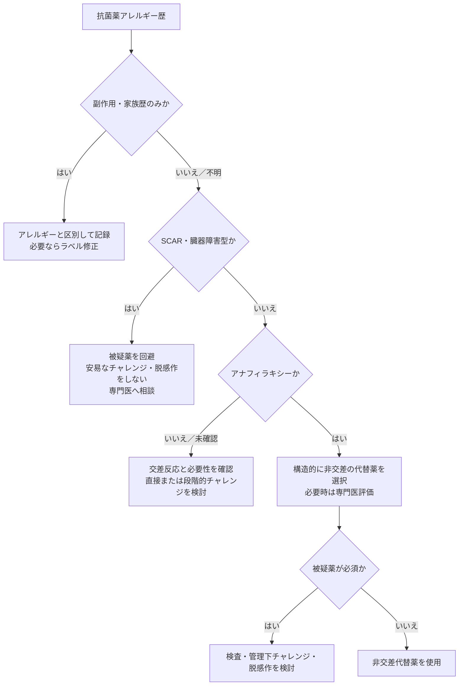

# 抗菌薬アレルギー

抗菌薬アレルギー歴がある患者で、反応型と交差反応性を整理し、必要な抗菌薬を安全に選択するためのクイックリファレンス。呼吸器感染症で使用頻度の高い薬剤を中心にまとめる。

## 交差反応の大まかな確率

| アレルギー歴 | 代替薬 | 交差反応の目安 |
|---|---|---:|
| ペニシリン系 | 同一R1側鎖のセフェム | **約16%** |
| ペニシリン系 | R1側鎖が異なるセフェム | **約2%** |
| ペニシリン系 | カルバペネム | **1%未満** |
| キノロン系 | 別のキノロン | **約2.5〜6%** |

!!! note "覚えておく例外"
    **CAZとAZTは同一側鎖を共有**する。サルファ抗菌薬と非抗菌薬サルホンアミドには、免疫学的交差反応を認めない。

!!! warning
    SCARや臓器障害型反応には、この表を適用しない。未確認のアレルギーラベルでは、実際のリスクはより低いことが多い。

---

## 初期評価

抗菌薬の「アレルギー」ラベルだけで一律に同系統薬を避けず、以下を確認する。

| 評価項目 | 確認内容 |
|---|---|
| 被疑薬 | 一般名、配合剤、投与経路、同時投与薬 |
| 症状 | 蕁麻疹、血管性浮腫、喘鳴、呼吸困難、血圧低下、皮疹、粘膜病変、発熱、臓器障害 |
| 発症時期 | 投与直後〜数時間、数日後、投与終了後 |
| 重症度 | アナフィラキシー、SCAR、臓器障害の有無 |
| 経過 | 発症からの年数、治療内容、再投与歴 |
| 忍容歴 | その後に問題なく使用できた同系統薬・類似薬 |

| 反応型 | 代表的な所見 | 基本方針 |
|---|---|---|
| 非アレルギー性副作用 | 悪心、下痢、頭痛、腱障害、QT延長など | アレルギーラベルと区別し、副作用として記録 |
| 即時型反応 | 投与後おおむね1〜6時間以内の蕁麻疹、血管性浮腫、喘鳴、低血圧 | アナフィラキシーの有無を確認し、代替薬・専門医評価を検討 |
| 良性遅発型皮疹 | 斑状丘疹状皮疹など。全身状態良好、粘膜・臓器障害なし | 時間経過と必要性に応じ、管理下の薬物チャレンジを検討 |
| SCAR・臓器障害型 | SJS/TEN、DRESS、AGEP、間質性腎炎、肝炎、溶血性貧血 | 被疑薬を回避。安易なチャレンジや脱感作を行わず専門医へ相談 |

!!! info "アレルギーとは限らない病歴"
    消化器症状などの薬理学的副作用、原疾患に伴う発疹、家族歴のみの場合は、免疫学的な薬物アレルギーとは区別する。アレルギー記録には、薬剤名だけでなく症状、重症度、発症時期、年月を残す。

---

## βラクタム系

### ペニシリン系とセフェム系

!!! tip "世代よりR1側鎖を見る"
    ペニシリンとセフェムの交差反応を最も規定するのは、通常**R1側鎖の構造類似性**。単に「どちらもβラクタム系だから危険」と判断せず、セフェムの世代より原因薬とのR1側鎖を確認する。R2側鎖やβラクタム環そのものによる交差反応はまれ。

#### 構造

| 薬剤群 | 基本構造 |
|---|---|
| ペニシリン系 | βラクタム環＋チアゾリジン環＋R1側鎖 |
| セフェム系 | βラクタム環＋ジヒドロチアジン環＋R1・R2側鎖 |

#### 特に注意する側鎖

| 原因ペニシリン | 同一・近似R1側鎖を持つ代表的セフェム |
|---|---|
| AMPC（アモキシシリン） | セファドロキシル、セフプロジル |
| ABPC（アンピシリン） | セファレキシン、セファクロル |

選択的ABPC/AMPCアレルギーが証明されている場合は、対応する同一R1側鎖薬を避ける。

#### 側鎖類似度別の交差反応

| R1側鎖の類似度 | セフェムの例 | 交差反応率 |
|---|---|---:|
| 同一（アミノセファロスポリン） | セファレキシン、セファドロキシル、セフプロジル、セファクロルなど | **16.45%**（95% CI 11.07〜23.75） |
| 中等度類似 | 一部のセフェム | **5.60%**（95% CI 3.46〜8.95） |
| 低類似度 | セファゾリン、セフポドキシム、セフトリアキソン、セフタジジム、セフェピムなど | **2.11%**（95% CI 0.98〜4.46） |

!!! info "この数値の対象"
    皮膚試験または薬物負荷試験で確認された**真のペニシリンアレルギー患者**を対象としたメタ解析の値。単なる病歴やカルテ上の未確認ラベルでは、実際の絶対リスクはさらに低い。

#### セファゾリンは重要な例外

- セファゾリンのR1側鎖は、通常使用するペニシリンや他のセフェムとほぼ共有されない
- ペニシリンアレルギー歴があっても交差反応は非常に少なく、手術時予防投与でも多くの場合使用可能
- JAMA Surgeryのメタ解析では、ペニシリンとセファゾリンの二重アレルギーは全体**0.7%**、未確認ペニシリンアレルギーでは**0.6%**。周術期にセファゾリンを投与された未確認群では**0.1%**だった
- 確認済みペニシリンアレルギー群の推定値は3.0%だったが、95%信用区間が0.01〜17.0%と広く、不確実性が大きい

#### セフェム同士・系統をまたぐ例外

同一・近似R1側鎖群では、セフェム同士でも交差し得る。

| 組み合わせ | ポイント |
|---|---|
| CTRX（セフトリアキソン）―CTX（セフォタキシム） | 近似するメトキシイミノR1側鎖を持ち、交差反応に注意 |
| CAZ（セフタジジム）―AZT（アズトレオナム） | 同一側鎖を共有する、系統をまたぐ重要な例外 |

AAAAI 2022年薬物アレルギー診療パラメータの要点：

1. ペニシリンによるアナフィラキシー歴があっても、**構造的に異なるR1側鎖のセフェムは検査や特別な予防措置なしに投与可能**（エビデンスの確実性：中等度）。
2. 未確認の非アナフィラキシー型ペニシリンアレルギーでは、セフェムを検査や特別な予防措置なしに投与可能（中等度）。
3. 選択的アミノペニシリンアレルギーが証明済みなら、同一R1側鎖のアミノセファロスポリンを避ける。

CDCは、IgE介在性ペニシリンアレルギー患者での交差反応率を、第3世代セフェムで**1%未満**、第1・2世代で**1〜8%**としている。

### カルバペネムとアズトレオナム

- ペニシリンアレルギーとカルバペネムの交差反応率は、メタ解析で**0.87%**（95% CI 0.32〜2.32）
- AAAAI 2022では、SCARなどを除き、ペニシリンまたはセフェムアレルギー歴があっても**カルバペネムは検査や特別な予防措置なしに投与可能**としている
- ペニシリン／セフェムとAZTの交差反応は基本的に認めない
- 例外として、**CAZとAZTは同一R1側鎖**を持つ。CAZ確定アレルギーではAZTを安易に代替しない

### PIPC/TAZアレルギーラベル

2024年の報告では、PIPC/TAZアレルギーラベルを持つ患者に対するセフェム系への薬物チャレンジは**38例中37例で成功**しており、高い忍容性が示された。

---

## キノロン系

呼吸器領域ではLVFX（レボフロキサシン）、MFLX（モキシフロキサシン）などを使用する。

### 反応の特徴

- 最も多いアレルギー反応は良性・自然軽快性の遅発型斑状丘疹状皮疹で、投与患者の**2〜3%**
- アナフィラキシーは**10万処方あたり1〜5件**と報告され、MFLXの関与が比較的多い
- 即時反応にはIgE介在性だけでなく、**MRGPRX2を介する非IgE性肥満細胞活性化**が含まれる。このため初回投与でも起こり得る
- キノロン皮膚試験は非特異的な肥満細胞活性化による偽陽性があり、標準化・検証されていない

### 同系統内の交差反応

即時型キノロンアレルギー歴があり、別のキノロンを投与された321曝露の後ろ向きコホートでは、即時反応は**8/321＝2.5%**（95% CI 1.2〜4.9）だった。

| 元のアレルギーラベル | 別キノロン投与後の反応 |
|---|---:|
| CPFX | 2.5% |
| LVFX | 2.0% |
| MFLX | 5.3%（19曝露のみで不確実） |

別の多施設入院コホートでも、異なるキノロン投与後の反応は全体で約6%で、投与薬別の反応率はMFLX 9.5%、CPFX 6.3%、LVFX 2.2%だった。いずれの研究も、別のキノロンを多くの患者が忍容できることを示す一方、リスクがゼロではないことにも注意する。

!!! warning
    これは電子診療録上のアレルギー歴と再曝露を用いた後ろ向き研究であり、全例が薬物チャレンジで確定されたIgEアレルギーではない。SCAR後の別キノロン投与を支持するデータでもない。

### 実臨床

- AAAAI 2022では、**非アナフィラキシー型反応歴**に対し、事前皮膚試験なしの1段階または2段階薬物チャレンジを提案（条件付き、低い確実性）
- 5年以上前の軽症反応では被疑薬、最近またはより重い反応では別のキノロンを用いた管理下チャレンジを検討できる
- 確定アレルギーで代替薬がなく、キノロンが必須なら専門医管理下の脱感作を検討する

---

## マクロライド系

呼吸器領域ではAZM（アジスロマイシン）、CAM（クラリスロマイシン）、EM（エリスロマイシン）を使用する。

- アレルギー反応はペニシリン、セフェム、ST合剤、キノロンより少なく、遅発型皮膚反応は約**1%**
- 詳細な評価を行うと、説得力のあるアレルギー歴のうち実際に確認されるのは約**5%**
- 皮膚試験は標準化されておらず、**薬物チャレンジが診断の中心**
- 良性皮膚反応歴では、1段階または2段階チャレンジにより約**95%が再導入可能**
- マクロライド間の交差反応は症例報告・小規模研究で認めるが、信頼できる全体確率は**不明**

小児61例の前向き評価では、マクロライドアレルギーが確認されたのは6例（9.8%）。AZMアレルギー確定例のうち2例がCAMにも反応したが、分母が極めて小さく、一般的な交差反応率として用いることはできない。

---

## テトラサイクリン系

呼吸器領域ではDOXY（ドキシサイクリン）、MINO（ミノサイクリン）を非定型肺炎、オウム病、Q熱、NTMなどで使用する。

- 即時型アナフィラキシーはまれ。遅発型では斑状丘疹状皮疹、固定薬疹、DRESS、SJS/TEN、薬剤性肝炎、MINO関連の自己免疫反応などが報告される
- 全体としてDOXYはMINOより重篤な過敏反応の報告が少ない
- 系統内交差反応率は**確立していない**。データは固定薬疹の小規模再投与研究と症例報告が中心
- テトラサイクリンによる固定薬疹6例の小規模研究では、別のテトラサイクリンに反応したのは2例であったが、一般化できない
- 必要性が高く、反応が非重症で皮膚試験陰性の場合は、専門施設で段階的チャレンジまたは脱感作を検討できる

---

## ST合剤・サルファ抗菌薬

ST合剤（TMP-SMX）はニューモシスチス肺炎、ノカルジア症、*Stenotrophomonas maltophilia*感染症などで重要である。

### 「サルファアレルギー」の整理

- サルファ抗菌薬と、フロセミド、チアジド系、SU薬、アセタゾラミド、セレコキシブなどの**非抗菌薬サルホンアミドとの免疫学的交差反応は認めない**
- 硫酸塩（sulfate）、亜硫酸塩（sulfite）、硫黄（sulfur）はサルホンアミド構造を持たず、交差反応しない
- 大規模後ろ向き研究で非抗菌薬サルホンアミド投与後の反応が多く見えたのは、特異的交差反応ではなく**薬物アレルギーを起こしやすい患者背景**によると解釈された

### 再評価とチャレンジ

重症遅発型反応を除外した「TMP-SMXまたはサルファアレルギー」204例の直接経口チャレンジでは、**191例（93.6%）が成功**した。

- 5年以上前の良性皮膚反応：AAAAI 2022は、ラベル解除が必要なら**1段階TMP-SMXチャレンジ**を提案
- 5年以内の非重症即時型・加速型反応：2段階チャレンジを検討
- SJS/TEN、DRESS、AGEP、薬剤性腎炎・肝炎：チャレンジ対象外
- 説得力のあるアナフィラキシー歴があり、代替薬がない場合：専門医管理下の脱感作を検討

---

## グリコペプチド系

### VCM infusion reactionとIgEアレルギー

- VCM投与中の紅潮、掻痒、上半身の紅斑、血圧低下は、注入速度に関連した非IgE性肥満細胞活性化である**vancomycin infusion reaction（VIR）**が多い
- VIRは通常、投与速度の低下、休薬後の再開、必要に応じた抗ヒスタミン薬で管理でき、VCMの永久回避を意味しない
- VIRと、少数ながら起こり得るIgE介在性アナフィラキシーを区別する

### VCM-DRESSと他のグリコペプチド

HLA-A\*32:01陽性VCM-DRESS 15例のex vivo研究では、全例がダルババンシンに陰性であった一方、TEICは2/15、テラバンシンは3/11で交差反応を認めた。これは臨床投与による忍容性確認ではないため、VCM-DRESS後の代替グリコペプチドはアレルギー専門医と検討する。

---

## アミノグリコシド系

呼吸器領域ではGM（ゲンタマイシン）、TOB（トブラマイシン；吸入を含む）、AMK（アミカシン）、ストレプトマイシンなどを使用する。

- 最多のアレルギー反応は、外用NEO（ネオマイシン）などによる接触皮膚炎。全身投与での即時型反応はまれ
- デオキシストレプタミン骨格を持つNEO、GM、TOB、AMK、KMなどの交差反応は、主に接触アレルギーデータで**約50%以上**
- NEOアレルギーからTOBへの交差反応は最大**65%**との報告がある
- ストレプトマイシンは構造が異なり、他のアミノグリコシドとの交差反応は比較的低い（約1〜5%との報告）
- TOB吸入が必須の嚢胞性線維症などでは、専門医管理下の脱感作報告がある

---

## CLDM・LZD

### CLDM（クリンダマイシン）

- 最も多いのは開始7〜10日後の遅発型斑状丘疹状皮疹
- 3,462人に3,896回投与した研究では、皮膚反応疑いは5例で、重症例はなかった
- 即時型皮膚試験の診断性能は低く、パッチテストも偽陰性がある。必要時の忍容性確認は薬物チャレンジが中心
- 他の抗菌薬との確立した交差反応率はない

### LZD（リネゾリド）

- 即時型・遅発型過敏反応はいずれもまれ
- 828例の研究では発疹・掻痒が1.7%、アナフィラキシー様反応が2例報告された
- 他の抗菌薬との交差反応データはない

---

## 実臨床フロー

!!! warning "薬物チャレンジと脱感作は別"
    **薬物チャレンジ**はアレルギーの有無や忍容性を確認する診断的投与。**脱感作**は確定または強く疑うアレルギー患者に必須薬を一時的に投与可能にする処置で、アレルギーラベルは解除できない。いずれも患者選択、監視、救急対応が可能な環境が必要。

---

## 参考文献

1. Khan DA, et al. [Drug allergy: A 2022 practice parameter update](https://health.ucdavis.edu/media-resources/antibiotic-stewardship/documents/pdfs/guidelines/drug-allergy-aaaai-2022.pdf). *J Allergy Clin Immunol*. 2022;150(6):1333-1393.
2. Picard M, et al. [Cross-Reactivity to Cephalosporins and Carbapenems in Penicillin-Allergic Patients](https://pubmed.ncbi.nlm.nih.gov/31170539/). *J Allergy Clin Immunol Pract*. 2019;7(8):2722-2738.e5.
3. CDC. [Penicillin Allergy — STI Treatment Guidelines, 2021](https://www.cdc.gov/std/treatment-guidelines/penicillin-allergy.htm).
4. Taggart M, et al. [Patients with piperacillin-tazobactam allergy labels tolerate other beta-lactams](https://pubmed.ncbi.nlm.nih.gov/38698713/). *Clin Exp Allergy*. 2024;54(7):521-523.
5. Azimi SF, et al. [Immediate Hypersensitivity to Fluoroquinolones: A Cohort Assessing Cross-Reactivity](https://pmc.ncbi.nlm.nih.gov/articles/PMC8962755/). *Open Forum Infect Dis*. 2022;9(4):ofac106.
6. Shah S, et al. [In-Class Cross-Reactivity among Hospitalized Patients with Hypersensitivity Reactions to Fluoroquinolones](https://pmc.ncbi.nlm.nih.gov/articles/PMC10269124/). *Antimicrob Agents Chemother*. 2023;67(6):e00374-23.
7. Süleyman A, et al. [Evaluation of Suspected Macrolide Allergies in Children](https://pmc.ncbi.nlm.nih.gov/articles/PMC8867500/). *Turk Arch Pediatr*. 2022;57(1):81-86.
8. Hamilton LA, Guarascio AJ. [Tetracycline Allergy](https://pmc.ncbi.nlm.nih.gov/articles/PMC6789857/). *Pharmacy (Basel)*. 2019;7(3):104.
9. Maciag MC, et al. [Hypersensitivity to tetracyclines: Skin testing, graded challenge, and desensitization regimens](https://pmc.ncbi.nlm.nih.gov/articles/PMC7250719/). *Ann Allergy Asthma Immunol*. 2020;124(6):589-593.
10. Krantz MS, et al. [Oral Challenge with Trimethoprim-Sulfamethoxazole in Patients with “Sulfa” Antibiotic Allergy](https://pmc.ncbi.nlm.nih.gov/articles/PMC6960372/). *J Allergy Clin Immunol Pract*. 2020;8(2):757-760.e4.
11. Strom BL, et al. [Absence of cross-reactivity between sulfonamide antibiotics and sulfonamide nonantibiotics](https://pubmed.ncbi.nlm.nih.gov/14573734/). *N Engl J Med*. 2003;349(17):1628-1635.
12. Nakkam N, et al. [Cross-reactivity between vancomycin, teicoplanin and telavancin in HLA-A\*32:01 positive vancomycin DRESS patients](https://pmc.ncbi.nlm.nih.gov/articles/PMC7674263/). *J Allergy Clin Immunol*. 2021;147(1):403-405.
13. Childs-Kean LM, et al. [Aminoglycoside Allergic Reactions](https://pmc.ncbi.nlm.nih.gov/articles/PMC6789510/). *Pharmacy (Basel)*. 2019;7(3):124.
14. Dilley M, et al. [Immediate and Delayed Hypersensitivity Reactions to Antibiotics: Aminoglycosides, Clindamycin, Linezolid, and Metronidazole](https://pmc.ncbi.nlm.nih.gov/articles/PMC9156451/). *Clin Rev Allergy Immunol*. 2022;62(3):463-475.
15. Sánchez-Borges M, et al. [Hypersensitivity reactions to non beta-lactam antimicrobial agents: a WAO statement](https://pmc.ncbi.nlm.nih.gov/articles/PMC4446643/). *World Allergy Organ J*. 2013;6(1):18.
16. Sousa-Pinto B, et al. [Assessment of the Frequency of Dual Allergy to Penicillins and Cefazolin: A Systematic Review and Meta-analysis](https://pmc.ncbi.nlm.nih.gov/articles/PMC7970387/). *JAMA Surg*. 2021;156(4):e210021.

!!! warning "免責事項"
    本ページは教育・個人参照目的のメモです。実際の投与可否は、感染症の重症度、代替薬、患者背景、反応型、アレルギー歴および施設の運用を踏まえて判断してください。
