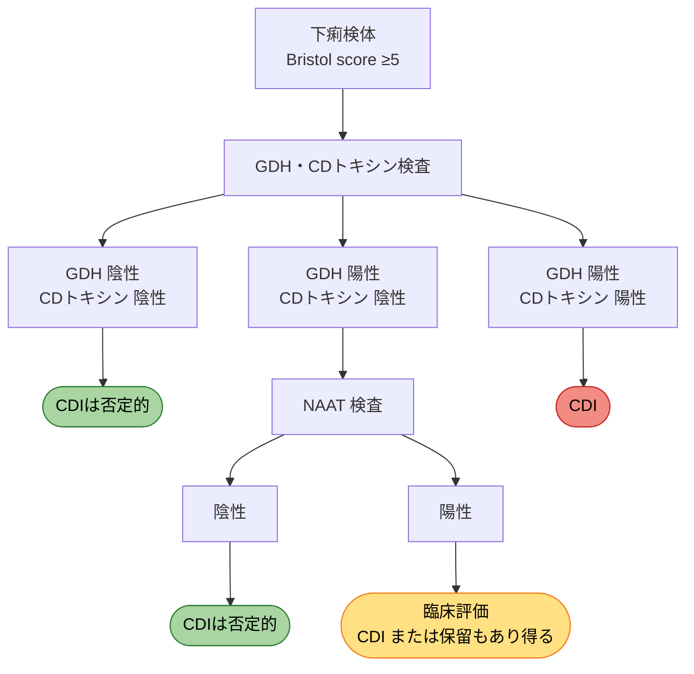

# CDI（Clostridioides difficile Infection）

- [亀田感染症レクチャー（2018）](https://www.kameda.com/pr/infectious_disease/post_61.html)
- [IDSA/SHEA ガイドライン 2018](https://academic.oup.com/cid/article/66/7/e1/4855916)

## 要点

- CDIは**抗菌薬下痢症の20〜30%**を占め、入院患者の感染性下痢症の原因で最多
- 抗菌薬使用歴のある入院患者で**1日3回以上の下痢**があった場合にCDI検査
- 検査：**GDH + CDトキシン → NAAT**（GDH陽性/トキシン陰性の場合）
- 治療：初回 Metronidazole、再発1回目 VCM、再発2回目 VCM tapered and pulsed
- 感染対策：接触感染対策（症状改善後**48時間**まで）、手洗いは**流水と石鹸**

---

## 定義

24時間以内に**3回以上の水様性便**、かつ以下のいずれか：

- 便検査で毒素産生 *C. difficile* またはトキシン陽性
- 偽膜性腸炎を示す病理組織または大腸内視鏡所見

---

## 疫学・リスク因子

| 項目 | 内容 |
|------|------|
| リスクの高い抗菌薬 | CLDM、FQ、広域セファロスポリン、カルバペネム |
| CDI発症リスク | 抗菌薬使用、高齢、入院期間延長、PPI、化学療法、IBD |
| CDI再燃リスク | 高齢、抗菌薬継続の必要性、再発歴、腎不全、PPI、初発時重症度 |
| 再発率 | 6〜25%（1回目再発率 20%、複数回再発後は 60%） |
| 潜伏期間 | colonization後 中央値2〜3日（ただし1週間以上の場合もあり） |
| 抗菌薬使用歴 | ほとんどの例で発症前14日以内（10〜12週以上での発症は稀） |

---

## 診断

### 検査対象

- 24時間以内に**3回以上の新規の下痢**を発症した入院患者
- 提出検体は**下痢便**が必須
    - 例外：イレウス → swab 可（感度十分）

!!! warning "注意"
    同一下痢エピソードでの再検査は診断に寄与しない（目安：7日以内は繰り返さない）

### 検査フロー

### 各検査の特性

| 検査 | 感度 | 特異度 | 備考 |
|------|------|------|------|
| NAAT | 非常に高い | Moderate | 無症候性キャリアでも陽性 |
| GDH | 85〜95% | 低い | トキシン産生の有無は不明 |
| トキシン A/B | 70〜80% | 高い | 室温2時間でdegrade → 速やかに検査 |

---

## 重症度分類

| 分類 | 基準 |
|------|------|
| **Non-severe** | WBC ≦15,000 かつ Cr <1.5 mg/dL |
| **Severe** | WBC >15,000 または Cr ≧1.5 mg/dL |
| **Fulminant** | 血圧低下（ショック）、イレウス、toxic megacolon |

!!! info
    CDトキシン陽性でも、**下痢がなければ治療対象とならない**

---

## 治療

**前提：不要な抗菌薬は中止する**

### 初回感染

| 重症度 | 治療薬 | 用法 |
|--------|--------|------|
| Non-severe | **Metronidazole** 500 mg ×3/日 | 10日間（改善なければ14日まで延長） |
| Non-severe（代替） | **VCM** 125 mg ×4/日 | 10日間 |
| Severe | **VCM** 125 mg ×4/日 | 10日間 |
| Fulminant | **VCM** 500 mg ×4/日 + **Metronidazole** 500 mg q8h (iv) | — |

!!! warning "Metronidazole の注意点"
    - 不可逆的な神経系蓄積毒性があるため、**2回目の使用は避ける**
    - Metronidazole で5〜7日以内に改善なければ VCM に変更
    - 最新ガイドライン（2018）では VCM または fidaxomicin を Metronidazole より強く推奨

!!! info "Fulminant の追加対応"
    イレウス合併例：VCM 注腸追加（500 mg を生食 100 mL に溶解、1時間かけて 1日4回）

### 再発時

| 状況 | 治療 |
|------|------|
| 1回目再発（初回 MNZ 使用） | VCM 125 mg ×4/日 10日間 |
| 1回目再発（初回 VCM 使用） | **VCM tapered and pulsed regimen**（下記） |
| 2回目以降の再発 | VCM tapered pulsed → rifaximin 20日 / fidaxomicin |
| 複数回再発 | **便微生物叢移植（FMT）**：成功率 81% vs 27%（VCM群） |

**VCM tapered and pulsed regimen：**

1. VCM 125 mg ×4/日 × 2週間
2. VCM 125 mg ×2/日 × 1週間
3. VCM 125 mg ×1/日 × 1週間
4. VCM 125 mg を2〜3日おき × 2〜8週間

### 治療コスト（参考）

| 薬剤 | コスト |
|------|--------|
| Metronidazole 500 mg ×3/日 10日間 | 約2,130円 |
| VCM 125 mg ×4/日 10日間 | 約11,131円 |
| VCM 500 mg ×4/日 10日間 | 約44,520円 |

---

## 感染対策

| 項目 | 内容 |
|------|------|
| 隔離期間 | 疑い時点〜**症状改善後48時間** |
| 部屋 | **個室隔離**（便失禁のある患者を優先） |
| PPE | 手袋 + ガウン |
| 手洗い | **流水と石鹸**（アルコール消毒は芽胞に無効） |
| 環境清掃 | **次亜塩素酸**（キッチンハイター等） |
| トイレ | 共有しない |

---

## 予防

- **抗菌薬の適正使用**が最重要
- ベズロトクスマブ（bezlotoxumab）：再発を 27% → 17% に減少
    - ジーンプラバ® 10 mg/kg 単回投与（VCM/Metronidazole 治療中に投与）
    - 価格：1瓶（625 mg）約330,500円
- 不要な PPI の中止（エビデンスはまだ不十分）
- Probiotics による1次予防のエビデンスは不十分

---

## 参考文献

1. Clin Infect Dis 2018;66(7):e1-e48（IDSA/SHEA ガイドライン）
2. N Engl J Med 2015;372:1539-48
3. N Engl J Med 2013;368:407-15（FMT 無作為化試験）
4. N Engl J Med 2017;376:305-17（bezlotoxumab）
