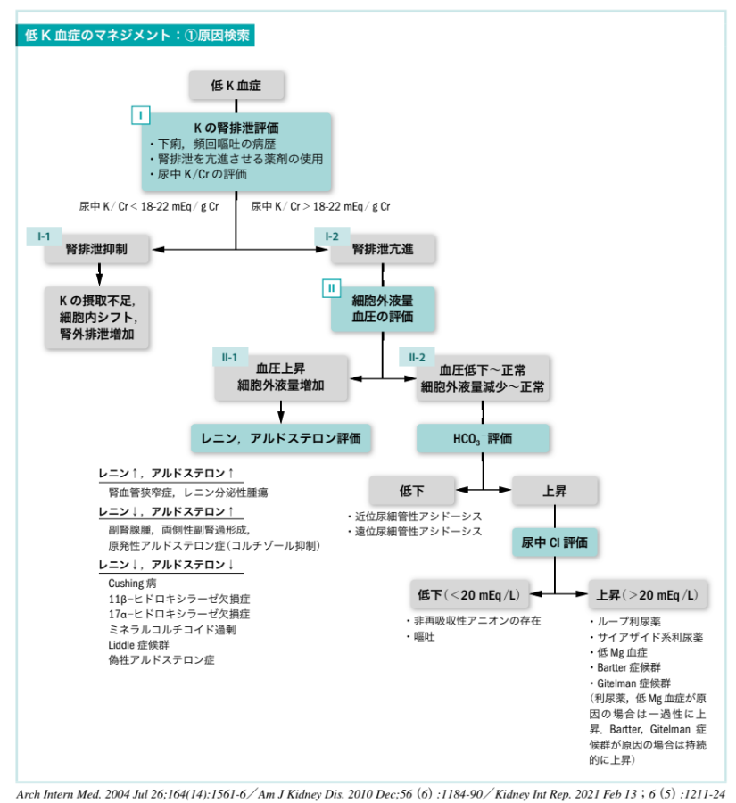
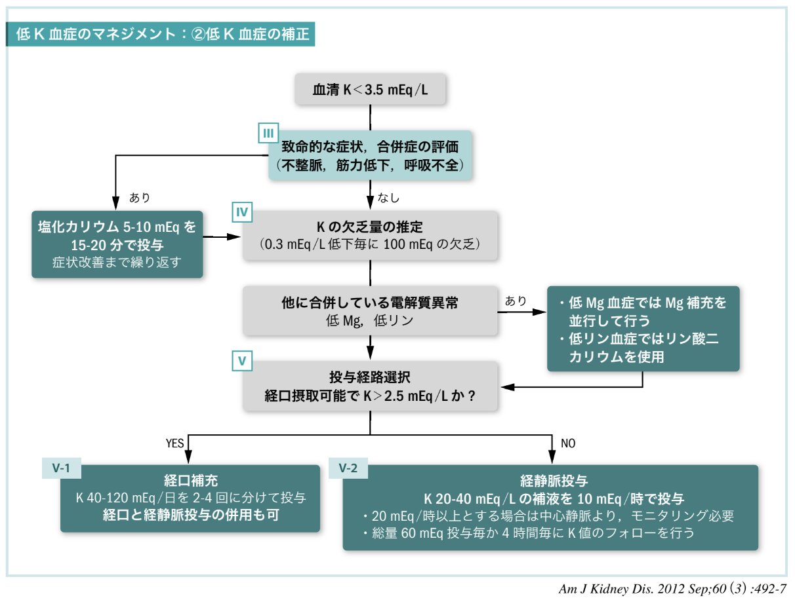

# 低カリウム血症

- ホスピタリストのための内科診療フローチャート　第3版

## 重要ポイント

- **重症度**：不整脈・筋力低下・呼吸不全の有無、ECG異常
- **原因の大枠**：摂取不足／細胞内シフト／排泄増加（尿中K/Crで腎性喪失を評価）
- **補正方針**：重症なら迅速補正、非重症は欠乏量推定＋経口/経静脈ルート選択

---

## カリウムの基礎知識

- 体内に存在する K は **50 mEq/kg**、そのうち血管内にあるのが **0.4%**
- 血清 K 濃度に関連する因子は **K 摂取・分布・排泄** の 3 つの機序で考える

---

## K の摂取・排泄

- K の 90% は腎排泄であり、そのうち 85-90% が遠位尿細管で再吸収される
- 尿中からの排泄は 5 mEq/L まで希釈可能
- 便より 10 mEq/日排泄され、1 日に排泄される K 量は最低で 15 mEq 程度
- それ以上の保持はできないため、1 日の K 摂取量が **<15 mEq** の場合は低 K 血症となる
- K の排泄に影響する因子：**血清 K 値・アルドステロン・集合管に到達する Na・H₂O 量**
  - 血清 K 値が高い場合：Na/K-ATPase が活性化され、尿中への K 排泄が亢進
  - アルドステロン作用が亢進すると：遠位尿細管における Na/K 交換が増加し、尿中への K 排泄が増加

> *Am J Kidney Dis. 2012 Sep;60(3):492-7*

---

## K の分布

- K の分布には **細胞の崩壊・Na/K-ATPase 関連・酸塩基平衡・浸透圧** が関与する
- 細胞崩壊により K は血中へ移行し、血清 K は上昇する
- Na/K-ATPase はインスリン・β₂ 刺激作用で活動性が上昇し、細胞外から細胞内へ K が移動 → 血清 K は低下する
- 酸塩基平衡異常では：
  - **アシドーシス**：K が細胞外へ移動（血清 K 上昇）
  - **アルカローシス**：K が細胞内へ移動（血清 K 低下）
  - 高浸透圧状態では K が細胞内へ移動

> *Am J Kidney Dis. 2012 Sep;60(3):492-7*

---

## 表1　K 濃度に関連する因子

| 機序 | 血清 K 低下 | 血清 K 上昇 |
|------|------------|------------|
| **K 摂取**（経口摂取・補液） | 摂取不足 | K 含有食品 |
| **K 分布**（細胞崩壊・Na/K-ATPase・酸塩基平衡・浸透圧） | 代謝性アルカローシス、高浸透圧、低 K 性周期性四肢麻痺 | 代謝性アシドーシス、細胞崩壊（腫瘍崩壊・横紋筋融解）、溶血、巨大な血腫、高 K 性周期性四肢麻痺 |
| **K 排泄**（腎排泄・腎外排泄） | 下痢、発汗、熱傷、高アルドステロン血症（原発性・二次性）、アルドステロン以外の鉱質コルチコイド過剰（フルドロコルチゾン・プレドニゾロン投与・Cushing 病など）、尿細管性アシドーシス、低 Mg 血症、Bartter 症候群・Gitelman 症候群・Liddle 症候群 | 腎不全（eGFR<15 mL/分/1.73 m²）、間質性腎炎、尿路閉塞、アミロイドーシス、慢性腎盂腎炎、循環血液量減少（腎不全合併例）、偽性低アルドステロン症、糖尿病関連腎臓病、Addison 病など |

> *BMJ. 2009 Oct 23;339:b4114 / Hippokratia. 2012 Oct;16(4):294-302*

---

## 表2　K 濃度異常に関連する薬剤

| 機序 | 低 K 血症に関連 | 高 K 血症に関連 |
|------|---------------|---------------|
| 摂取 | — | K 製剤、ハーブ類、輸血 |
| 分布 | インスリン、β₂ 刺激薬、バリウム中毒、クロロキン | β 遮断薬、ジゴキシン、高浸透圧性利尿薬、ST 合剤、サクシニルコリン |
| 排泄 | ステロイド、グリチルリチン（甘草）、ループ利尿薬、サイアザイド系利尿薬、アセタゾラミド、下剤 | ACE 阻害薬、ARB、ARNI、スピロノラクトン、エプレレノン、NSAIDs、ヘパリン、シクロスポリン、タクロリムス、ケトコナゾール、フルコナゾール、イトラコナゾール、ST 合剤、ペンタミジン |

> *BMJ. 2009 Oct 23;339:b4114 / Hippokratia. 2012 Oct;16(4):294-302*

---

## 低 K 血症のマネジメント：①原因検索

## 低 K 血症原因検索フローチャート

> *Arch Intern Med. 2004 Jul 26;164(14):1561-6 / Am J Kidney Dis. 2010 Dec;56(6):1184-90 / Kidney Int Rep. 2021 Feb 13;6(5):1211-24*

### チャート I　低 K 血症の初期評価

- 下痢・頻回の嘔吐・低 K 血症の原因となる薬剤（表2）の使用歴を評価する
- 下痢では便からの K 排泄が亢進する
- 頻回の嘔吐ではアルカローシスに伴い K が細胞内シフトすることで低 K 血症となる。他に脱水症によるレニン-アンジオテンシン-アルドステロン系の亢進が生じ、腎排泄が増加することがある
- 腎臓からの K 排泄を評価するには **尿中 K/Cr を指標** とする
- 24 時間の蓄尿で K 排泄量が **<25-30 mEq** であれば、尿は適切に排泄を制限していると判断できる。随時尿で評価可能な **尿中 K/Cr** を用いることが一般的

> *J Clin Invest. 1959 Jul;38(7):1134-48*

#### 尿中 K/Cr の計算式
**尿中 K/Cr（mEq/g Cr）= K（mEq/L）/ Cr（mg/dL）× 100**

### チャートI-1　尿中 K/Cr < 18-22 mEq/g Cr は K の腎排泄が抑制されていることを示唆

- K の摂取不足・細胞内シフト・腎外排泄の増加による低 K 血症を示唆する（鑑別は表1参照）

### チャートI-2　尿中 K/Cr > 18-22 mEq/g Cr は K の腎排泄の亢進を示唆

- 腎排泄亢進があれば細胞外液量や血圧を評価する（チャートII）

### チャートII　K の腎排泄亢進のアセスメント

- 腎排泄亢進による低 K 血症では **細胞外液量・血圧** を評価する

#### チャートII-1　細胞外液量増加・高血圧がある場合はレニン・アルドステロンを評価する

- **レニン↑・アルドステロン↑**：腎血管狭窄症、レニン分泌性腫瘍の可能性を考慮
- **レニン↓・アルドステロン↑**：副腎腺腫、両側性副腎過形成、原発性アルドステロン症を考慮
- **レニン↓・アルドステロン↓**：Cushing 病、11β-ヒドロキシラーゼ欠損症、17α-ヒドロキシラーゼ欠損症、ミネラルコルチコイド過剰、Liddle 症候群、偽性アルドステロン症（グリチルリチン中毒）、フルドロコルチゾンやプレドニゾロン投与の可能性を考慮

#### チャートII-2　細胞外液量・血圧が低下〜正常の場合は HCO₃⁻ を評価する

- **HCO₃⁻ が低下**すれば近位尿細管性アシドーシス、遠位尿細管性アシドーシスを考慮
  - 尿細管性アシドーシスについては酸塩基平衡異常を参照
- **HCO₃⁻ が上昇**している場合、さらに **尿中 Cl** を評価
  - **尿中 Cl が低下（<20 mEq/L）**：非再吸収性アニオンの存在、嘔吐による低 K 血症を考慮
  - **尿中 Cl が上昇（>20 mEq/L）**：ループ利尿薬、サイアザイド系利尿薬の使用、低 Mg 血症、Bartter 症候群・Gitelman 症候群を考慮
    - 利尿薬や低 Mg 血症が原因の場合は、原因の除去・電解質補正とともに尿中 Cl 上昇も改善する
    - Bartter 症候群や Gitelman 症候群が原因の場合は **持続的に** 尿中 Cl 上昇が認められる

---

## 低 K 血症のマネジメント：②低 K 血症の補正

## 低 K 血症補正フローチャート（血清 K < 3.5 mEq/L）

> *Am J Kidney Dis. 2012 Sep;60(3):492-7*

### チャートIII　致命的不整脈（心室性頻拍・torsades de pointes）や筋力低下・呼吸不全が認められる低 K 血症では塩化カリウム 5-10 mEq を 15-20 分で投与し、改善するまで繰り返す

- K は末梢ルートから投与する場合、補液中の K 濃度 **<40 mEq/L**、投与速度 **≦20 mEq/時** で投与する必要がある。それを超えると血管痛・血管炎のリスクとなる
- 急速補正における補液中の K 濃度は 40 mEq/L を超え、投与速度も >20 mEq/時となるため、**中心静脈ルートを確保**し補正する必要がある
- 塩化カリウム注の添付文書の記載とは異なるが、中心静脈ルートからであれば K 濃度 **100-200 mEq/L** 程度の輸液で、1 時間当たり 40 mEq 程度の補充を行っても合併症リスクは低く、安全に投与可能とする報告が多い（Q&A参照）

### チャートIV　致命的な症状がない場合は K 欠乏量の推定と低 Mg 血症・低リン血症の評価を行う

- 低 K 血症では、K 濃度 **0.3 mEq/L 低下毎に 100 mEq** の K 欠乏があると考える
- 低 K 血症では低 Mg 血症・低リン血症も評価し、必要があれば補正する
- **低 Mg 血症が合併している場合**：尿中 K 排泄が亢進するため、K を補充しても改善しにくい → Mg も同時に補う必要がある
- **低リン血症が合併している場合**：塩化カリウム製剤ではなくリン酸二カリウム（K₂HPO₄）を用いて補正するとよい

### チャートV　症状が安定した患者における K 補正

#### チャートV-1　経口摂取が可能で血清 K > 2.5 mEq/L であれば経口から補充する

- K 40-120 mEq/日を 2-4 回に分けて投与
- 経口のみで補い切れない場合は経静脈投与も併用する

#### チャートV-2　経口摂取が困難な場合・血清 K < 2.5 mEq/L では経静脈投与で補正する（経口摂取可能であれば併用で補正を行う）

- K 20-40 mEq/L（500 mL に塩化カリウム 20 mEq 混注）で **10 mEq/時程度の速度** であれば末梢ルートから投与可能
- それよりも高濃度となる場合は末梢ルートでは血管炎のリスクとなるため、**中心静脈ルートの確保が推奨**される
- 末梢ルートの場合、速度は **20 mEq/時を超えない** ように注意する
- 経静脈ルートからの K 補正では **60 mEq 投与毎に、4 時間毎の K 値フォロー** が推奨される

---

## 表3　各薬剤の K 含有量（添付文書）

| 薬剤 | K 含有量 | 1 日投与量 | 1 日 K 量（最大） | 注意 |
|------|---------|-----------|----------------|------|
| 塩化カリウム徐放錠 600 mg「St」 | 8 mEq/錠 | 2 錠 | 16 mEq | 経管からの投与不可 |
| K.C.L.® エリキシル | 1.34 mEq/mL | 20-100 mL | 134 mEq | 水で 10-20 倍希釈して投与する必要あり |
| アスパラ® カリウム錠 | 1.8 mEq/錠 | 最大 10 錠 | 18 mEq | — |
| アスパラ® カリウム散 | 2.9 mEq/g | 最大 6 g | 17.4 mEq | — |
| グルコンサン K 錠 | 2.5-5.0 mEq/錠 | 1 回 10 mEq を 3-4 回 | 40 mEq | — |
| グルコンサン K 細粒 | 4 mEq/g | 1 回 10 mEq を 3-4 回 | 40 mEq | — |

- 経口薬剤は塩化カリウム製剤（塩化カリウム徐放錠 600 mg「St」・K.C.L.® エリキシル）・L-アスパラギン酸カリウム（アスパラ® カリウム）がある
- 添付文書上、最も多く投与可能なのは **K.C.L. エリキシル®** であるが、水で 10 倍希釈する必要があるため、1 日に 1L ほど飲む必要がある。経口で補い切れない場合は経静脈的補充を併用するほうがよい

---

## Q&A

### Q　経静脈投与における K 補正の濃度・速度はどうすればよいでしょうか

**A** 塩化カリウム注® の添付文書には、投与時の濃度は **40 mEq/L まで**、投与速度は **20 mEq/時まで**、1 日 100 mEq までとの記載があり、急速補正時にはその記載について薬剤部から疑義照会があるかもしれない。末梢ルートからの投与では静脈炎や血管痛のリスクがあるため、規定の濃度・速度を守る必要があるが、心不全で補液負荷ができない場合、重度の低 K 血症で早期に補正が必要な場合は上記濃度・速度では不十分となる。この場合、経口からの補充を併用するか、中心静脈カテーテルを留置し、より高濃度・早い速度で投与する必要がある。

ICU 管理中の低 K 血症を伴う成人患者 48 例を対象とした前向きコホート研究において、塩化カリウム 20 mEq/100 mL 溶液・30 mEq/100 mL 溶液・40 mEq/100 mL 溶液を中心静脈カテーテルより 1 時間で投与しても血行動態の不安定化や不整脈の報告は認められなかった（*Crit Care Med. 1991 May;19(5):694-7*）。

他に、ICU において、塩化カリウム 20 mEq/100 mL 溶液を 1 時間で投与する方法を 495 回使用した経験では、投与前後の K 上昇値は 0.25 mEq/L で、致命的な副作用は認められなかったとする報告もある（*Arch Intern Med. 1990 Mar;150(3):613-7*）。

さらに他にもいくつかの報告があり、どの報告でも **20 mEq/100 mL を 1 時間で投与する方法は安全である** と結論づけている（*J Clin Pharmacol. 1994 Nov;34(11):1077-82 / Zhongguo Wei Zhong Bing Ji Jiu Yi Xue. 2008 Jul;20(7):416-8*）。

添付文書に記載されている方法ではないため、各施設の基準に従うのが原則だが、投与量が不十分であることで患者さんに不利益を与えるのは避けるべきと筆者は考えている。

---

## 参考文献

1. BMJ. 2009 Oct 23;339:b4114
2. Hippokratia. 2012 Oct;16(4):294-302
3. Am J Kidney Dis. 2012 Sep;60(3):492-7
4. Arch Intern Med. 2004 Jul 26;164(14):1561-6
5. Am J Kidney Dis. 2010 Dec;56(6):1184-90
6. Kidney Int Rep. 2021 Feb 13;6(5):1211-24
7. J Clin Invest. 1959 Jul;38(7):1134-48
8. Crit Care Med. 1991 May;19(5):694-7
9. Arch Intern Med. 1990 Mar;150(3):613-7
10. J Clin Pharmacol. 1994 Nov;34(11):1077-82
11. Zhongguo Wei Zhong Bing Ji Jiu Yi Xue. 2008 Jul;20(7):416-8
