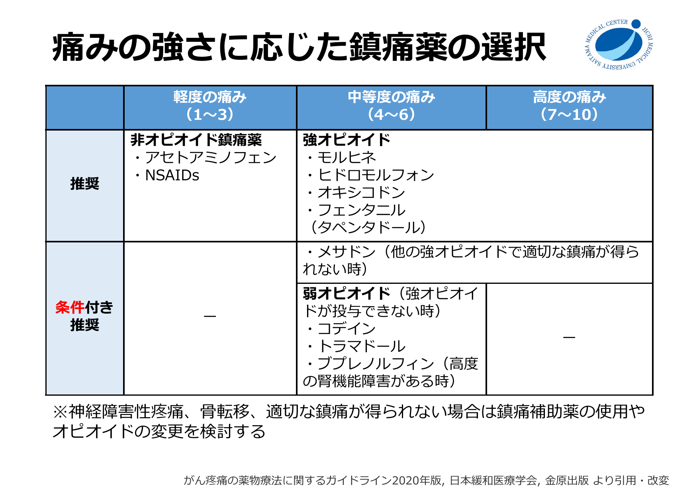
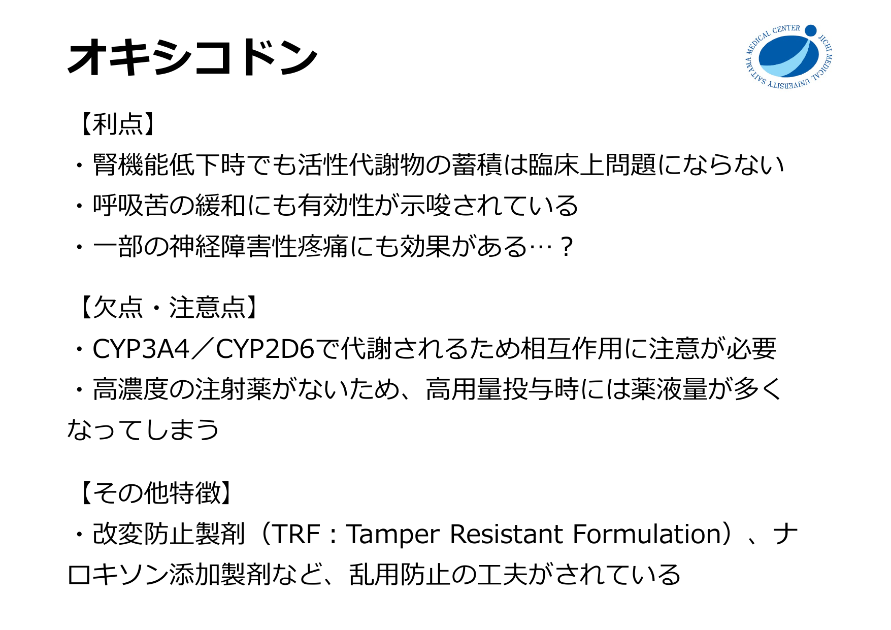
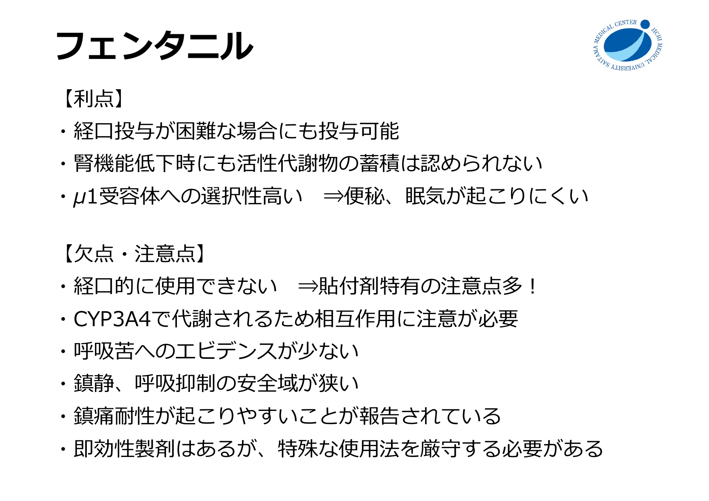
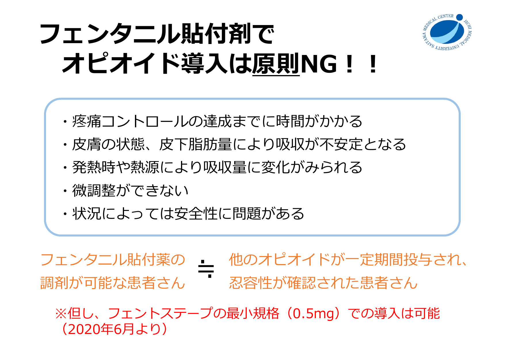
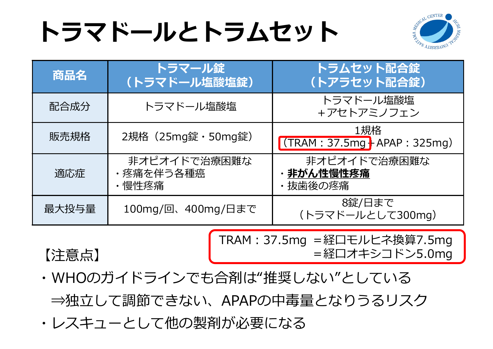
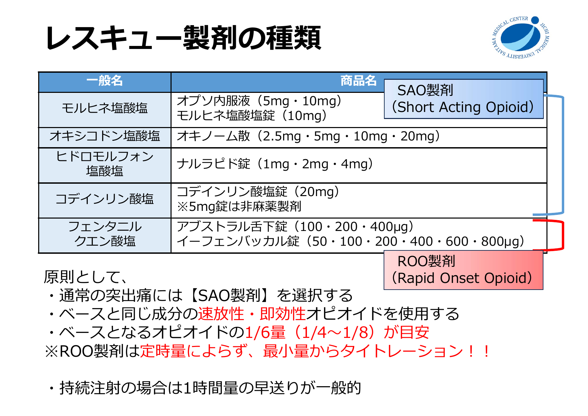
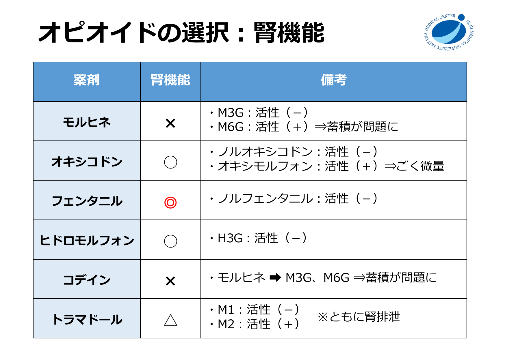
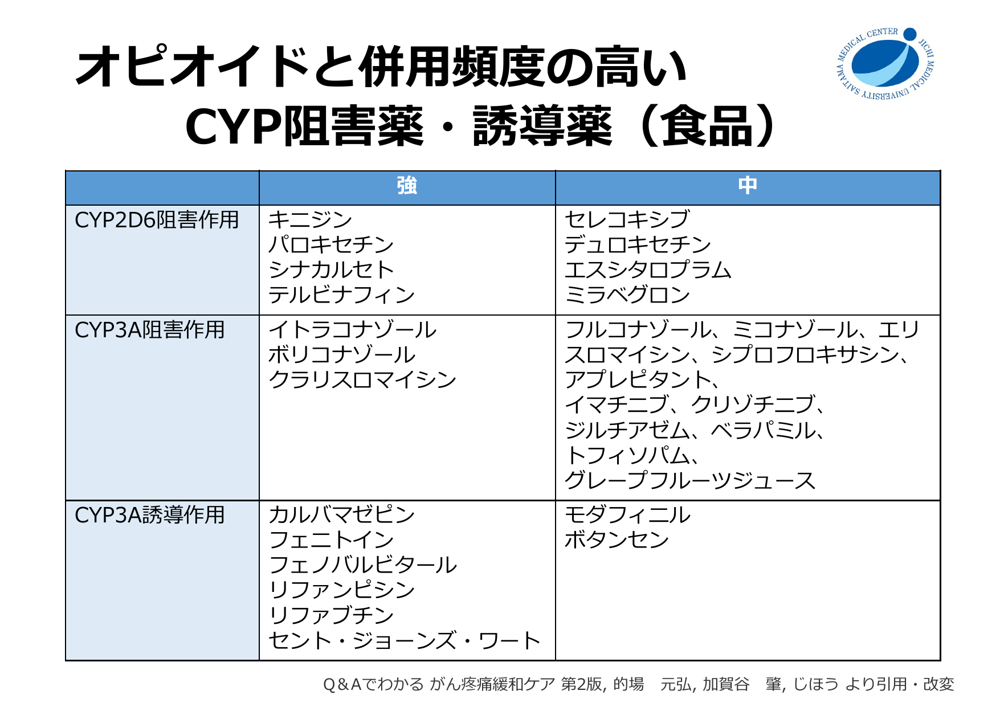
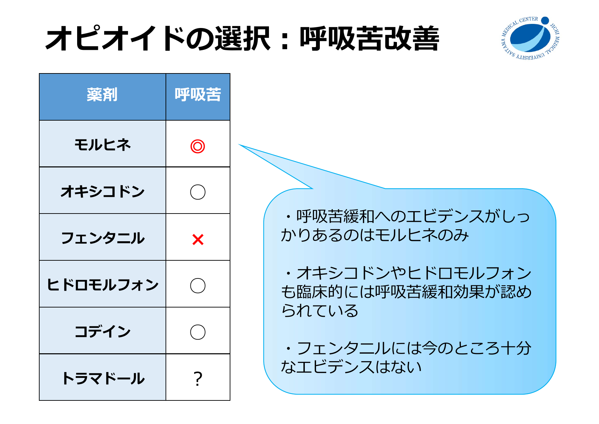
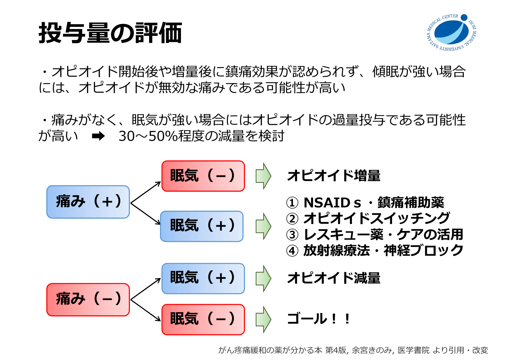

# がん性疼痛に対するオピオイド

## 痛みの強さに応じた薬剤選択

!!! note "ポイント"
    - 中等度〜高度の痛みには**強オピオイド**（モルヒネ・ヒドロモルフォン・オキシコドン・フェンタニル）が第一選択
    - 弱オピオイド（コデイン・トラマドール）は「強オピオイドが投与できない時」の条件付き推奨
    - 神経障害性疼痛・骨転移・難治性疼痛では鎮痛補助薬やオピオイド変更を検討

---

## オピオイドの使い分け

### 腎機能による選択

### 相互作用による選択

!!! warning "CYP3A4/CYP2D6 に注意"
    オキシコドン・フェンタニルは CYP3A4 で代謝。イトラコナゾール、ボリコナゾール、クラリスロマイシン、リファンピシンとの併用で血中濃度が大きく変動する。

### 製剤の種類

---

## 等価換算

**換算の基準：経口モルヒネ 30 mg/日 = 経口オキシコドン 20 mg/日 = 経口ヒドロモルフォン 6 mg/日 = フェントステープ 1.0 mg/日 = フェンタニル注 0.3 mg/日**

---

## レスキュードーズ

### レスキュー製剤の種類

!!! info "原則"
    - 通常の突出痛には **SAO製剤**（Short Acting Opioid）を選択
    - ベースと同じ成分の速放性製剤を使用
    - レスキュー量の目安：ベース 1 日量の **1/6（1/4〜1/8）**
    - 持続静注の場合は **1 時間量の早送り**が一般的

### レスキュー薬の効果判定時間

---

## 用量調節

### 増量方法

- **レスキュー使用分を上乗せする方法**：1日レスキュー総量 ＋ 定時量 ＝ 翌日の投与量
- **定時薬を増量する方法**：鎮痛・副作用を評価し 30〜50% ずつ増量
  - 経口モルヒネ換算 120 mg/日まで：50% まで増量可
  - 120 mg/日以上：20〜30% の増量

### 増量間隔の目安

### 投与量の評価（痛み × 眠気）

| 痛み | 眠気 | 対応 |
|------|------|------|
| あり | なし | **オピオイド増量** |
| あり | あり | NSAIDs・鎮痛補助薬 / オピオイドスイッチング / レスキュー活用 / 放射線・神経ブロック |
| なし | あり | **オピオイド減量**（30〜50%） |
| なし | なし | **ゴール** |

---

## オキシコドン静注 / 皮下注タイトレーション

### 前提
- オキファスト注 10 mg/1 mL を前提とする
- **0.05 mL/hr = 0.5 mg/hr**

### 開始
**オキシコドン持続静注 or 持続皮下注 0.05 mL/hr［0.5 mg/hr］で開始**

### レスキュー
- 疼痛時：意識清明 かつ RR 10回/分以上なら 1時間量を早送り
- 30分以上あけて反復可

### 増量
- 意識清明 かつ 悪心等の副作用が許容可能 かつ RR 10回/分以上 の場合
- 8時間でレスキュー3回使用したら、0.05 mL/hr [0.5 mg/hr] ずつ増量

### 経口移行
- 換算：力価は静注4:経口3。静脈注射の必要量を 3/4 すれば良い。
- 直近 24 時間の総必要量を集計 → 経口徐放製剤の 1 日量へ換算 → レスキューは速放性オキシコドンで設定

---

## 副作用マネジメント

### オピオイドの副作用

!!! warning "3大副作用"
    - **便秘**（95%）：耐性なし → 緩下剤は必須、オピオイド開始時から予防投与
    - **悪心・嘔吐**（30%）：耐性あり → 約2週間で耐性出現、制吐剤は短期使用でよい
    - **眠気**（20%）：耐性あり → 3〜5日で消失することが多い

### 悪心・嘔吐の治療
- 第1選択：**プロクロルペラジン（ノバミン）** − 延髄のドパミン受容体拮抗
- ドンペリドン・メトクロプラミドは中枢移行が少なく効果不十分になりやすい
- 体動時に誘発される場合 → ジフェンヒドラミン（トラベルミン）が有効なことあり

### OIC（オピオイド誘発性便秘）
- モルヒネ・コデイン・オキシコドン・ヒドロモルフォンはほぼ全例で便秘
- フェンタニルは μ1 受容体選択性が高く便秘は軽度になりやすい
- 経口投与 > 静注・皮下注 で便秘の程度が強い
- **ナルデメジン（スインプロイク）**（PAMORA）：腸管のオピオイド受容体を末梢でブロック、緩下効果とは異なる機序

---

## オピオイドスイッチング

| 理由 | スイッチング先 |
|------|---------------|
| 腎機能障害 | モルヒネ → ヒドロモルフォン・オキシコドン → フェンタニル・メサドン |
| CYP3A4 相互作用 | オキシコドン・フェンタニル → モルヒネ・ヒドロモルフォン |
| 鎮痛不十分 | フェンタニル → モルヒネ・ヒドロモルフォン・オキシコドン → メサドン |
| 呼吸困難・咳嗽 | フェンタニル → モルヒネ・ヒドロモルフォン・オキシコドン |
| 副作用 | 減量検討 → スイッチング |

!!! note "スイッチング時の用量設定"
    - 痛みが十分コントロールされている場合：計算上の等鎮痛用量から **25〜50% 減量**して開始
    - 痛みコントロール不十分な場合：等鎮痛用量の **100〜125%** で開始可

---

## 参考資料

1. 中川 朗宏. 医療用麻薬の基本的な考え方と処方意図. 第11回 がん薬物療法勉強会（自治医科大学附属さいたま医療センター）, 2024年9月
2. 日本緩和医療学会. がん疼痛の薬物療法に関するガイドライン 2020年版
3. 余宮きのみ. がん疼痛緩和の薬が分かる本 第4版, 医学書院

!!! info "免責事項"
    このページは教育目的の個人用クイックリファレンスです。最終判断は担当医の臨床判断に基づくこと。
